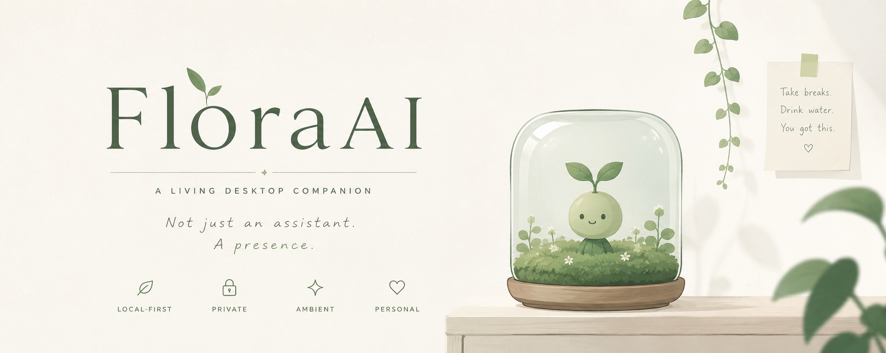
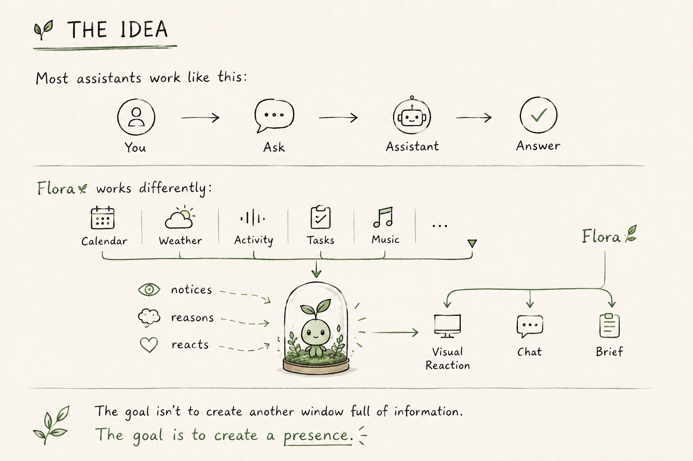

# 🌱 Flora

> **A living desktop companion that notices your day, so you don't have to explain it.**

  

  <strong>Local-first · Private · Ambient · Personal</strong>

  <a href="#-what-is-flora">What is Flora?</a> ·
  <a href="#-features">Features</a> ·
  <a href="#-privacy-first">Privacy</a> ·
  <a href="#-getting-started">Getting Started</a> ·
  <a href="#-architecture">Architecture</a>

---

## 🌿 What is Flora?

Flora isn't another chatbot window.

She's a small presence that lives on your desktop — quietly observing the rhythm of your day and reacting to it.

She wakes up with you.
She checks what's ahead.
She notices when you've been away.
She becomes focused when you are.
And when something worth celebrating happens, she celebrates with you.

Instead of waiting for you to ask:

> **Flora notices.**

---

## ✦ The Idea

  

Flora isn't designed to be another window full of information.

**The goal is to create a presence.**
---

## 🌱 Features

### ☀️ Morning Brief

Flora can greet you with a short, contextual briefing based on your day.

- Upcoming calendar events
- Weather
- Important tasks
- Other connected signals

No giant dashboard. Just:

> "Good morning. You have a 10:30 meeting, rain later today, and a pretty open afternoon."

### 🌿 Ambient Awareness

Flora can notice the rhythm of your day through lightweight signals.

Depending on what you allow:

- Idle time
- Task activity
- File activity
- Music activity
- Calendar proximity
- Application activity

Flora doesn't need to constantly interrupt you. Sometimes the most appropriate response is simply: **nothing.**

### ✨ A Living Avatar

Flora has 8 distinct states, each representing a different moment or mood:

| State | Meaning |
|---|---|
| 🌱 Idle | Waiting quietly |
| 👋 Greeting | Welcoming you |
| 🎯 Focused | You're deep in a task |
| 🎉 Celebrating | Something went well |
| 😴 Sleepy | The day is winding down |
| 💭 Thinking | Processing something |
| 🌙 Offline | Flora is unavailable |
| ❔ Confused | Something doesn't quite add up |

Each state has its own visual behaviour and animation. Flora should feel alive without becoming distracting.

### 💬 Local Conversations

Click the terrarium and talk to Flora.

Her reasoning layer runs through Ollama, using a model hosted locally on your machine.

No cloud chatbot required. No API key. No per-message billing.

---

## 🔒 Privacy First

Flora is designed around a simple principle:

> Your desktop is yours.

The core experience runs locally.

### 🧠 Local AI

Flora uses Ollama instead of a hosted AI API. That means:

- No AI API key
- No account required
- No per-message costs
- No cloud conversation history
- No dependency on a hosted model

Your conversations stay on your machine.

### 🔐 Local Memory

Activity history and mood trends are stored in a local encrypted SQLite database.

The encryption key is kept in your operating system's native keychain rather than inside the repository or as a plaintext file.

### 🔑 OAuth Credentials

Calendar and Spotify require access to data that lives outside your machine. Those credentials are handled differently.

OAuth tokens are stored using the operating system's native credential store:

- **Windows** → Credential Manager
- **macOS** → Keychain
- **Linux** → libsecret

They are never stored in the application database or a `.env` file.

### 👁️ Minimal Activity Tracking

Activity awareness is opt-in. Flora does not need to read your files to understand that you're working.

When activity tracking is enabled, Flora works with metadata rather than file contents.

The goal is:

\`\`\`
"What are you doing?"
        ↓
"What does Flora actually need to know?"
        ↓
"Nothing more than that."
\`\`\`

---

## 🧩 Integrations

Flora works perfectly well without integrations. Integrations simply give her more context.

| Integration | What Flora can learn |
|---|---|
| 📅 Calendar | Upcoming events & schedule |
| ☁️ Weather | Current conditions & forecast |
| 📝 Notes / Tasks | What you're working toward |
| 🎵 Spotify | Music activity |
| 🖥️ Desktop | Optional activity signals |

Everything is optional and skippable. No integrations connected? That's okay — Flora simply knows less.

---

## 🏗️ Architecture

Flora is built as a local-first desktop application using:

\`\`\`
┌──────────────────────────────────────────┐
│              Flora Desktop                │
├──────────────────────────────────────────┤
│                                            │
│  React + TypeScript                       │
│  ├── Avatar                               │
│  ├── Terrarium                            │
│  ├── Chat                                 │
│  ├── Onboarding                           │
│  └── Signal UI                            │
│                                            │
├──────────────────────────────────────────┤
│                                            │
│  Reasoning Layer                          │
│  ├── Character                            │
│  ├── Context                              │
│  ├── Tool schemas                         │
│  └── Ollama                               │
│                                            │
├──────────────────────────────────────────┤
│                                            │
│  Tauri / Rust Backend                     │
│  ├── Desktop shell                        │
│  ├── Local storage                        │
│  ├── Secure credentials                   │
│  └── System integrations                  │
│                                            │
└──────────────────────────────────────────┘
\`\`\`

### Project Structure

\`\`\`
flora/
│
├── src/
│   ├── components/       # UI, avatar & terrarium
│   ├── core/             # State machine & application logic
│   ├── routes/           # Application views
│   ├── store/            # Local application state
│   ├── types/            # Shared TypeScript contracts
│   └── utils/            # Shared utilities
│
├── src/llm/
│   ├── character/        # Flora's personality
│   ├── tools/             # Tool definitions
│   └── ollama/            # Local model integration
│
├── src-tauri/
│   ├── shell/             # Desktop window & system integration
│   ├── memory/            # Local encrypted storage
│   └── security/          # Credential handling
│
├── flora-ai-srs.md        # Product & technical specification
└── flora-preview.html     # Original avatar prototype
\`\`\`

---

## 🚀 Getting Started

### Requirements

- Node.js
- Rust + Cargo
- [Ollama](https://ollama.com)
- A local Ollama-compatible model

### 1. Install a model

\`\`\`bash
ollama pull llama3.2
\`\`\`

### 2. Clone the repository

\`\`\`bash
git clone <repository-url>
cd flora
\`\`\`

### 3. Install dependencies

\`\`\`bash
npm install
\`\`\`

### 4. Start Flora

\`\`\`bash
npm run dev
\`\`\`

On first launch, Flora will guide you through onboarding. Every integration can be skipped — you can start with nothing connected and add context later.

---

## 🌱 Design Philosophy

Flora is built around a few principles.

**Presence over interruption**
Flora should be noticeable, not annoying.

**Context over commands**
She should understand what's happening before asking you what to do.

**Local over cloud**
If something can happen locally, it should.

**Minimal data over maximal data**
Collect only what Flora actually needs.

**Personality over polish**
Flora shouldn't feel like another productivity dashboard. She should feel like someone is there.

---

## 🧪 Development Status

Flora is currently under active development, being built incrementally against the project SRS.

**Current**
- [x] Desktop shell
- [x] Avatar state machine
- [x] Terrarium prototype
- [x] Local memory architecture
- [x] Calendar integration
- [x] Weather integration
- [x] Notes / task integration
- [x] Spotify integration
- [x] Local LLM reasoning
- [x] Onboarding flow

**In progress**
- [ ] Final avatar animations
- [ ] Ambient desktop behaviour
- [ ] Production security hardening
- [ ] Cross-platform packaging
- [ ] Final UX polish

---

## 📖 Documentation

The Software Requirements Specification is the source of truth for Flora's architecture, behaviour, privacy model, and threat model.

→ [`flora-ai-srs.md`](./flora-ai-srs.md)

The original visual prototype is also included:

→ [`flora-preview.html`](./flora-preview.html)

---

## 🌿 Why Flora?

There are already plenty of assistants that wait for you to type.

Flora is built around a different idea: **what if your assistant could simply be there?**

Not watching everything.
Not interrupting constantly.
Not sending your life to a server.

Just quietly noticing the rhythm of your day... and responding when it matters.

🌱 <strong>Flora</strong> 
A little presence on your desktop. 
Local. Private. Alive.

---

## License

License not yet decided. Until a LICENSE file is added, this project should be treated as all rights reserved.
